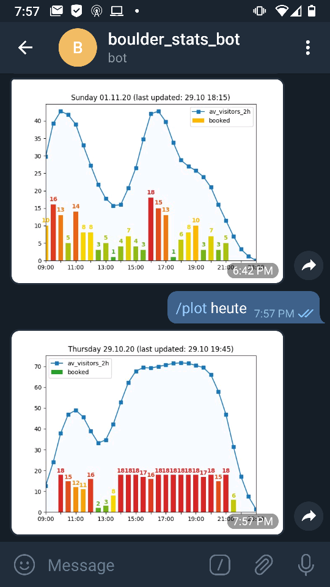

<div><h1 align="center">boulder-stats</h1>
	
	<p>
		Data collection script and telegram-bot to monitor the local Boulderhaus' booking state.
		It shows the currently booked spots for each timeslot and the average number of visitors during the whole stay.
	</p>
</div>


## 🚧 Setup

### Installation (not yet tested)

* Set up a Telegram-Bot (https://core.telegram.org/bots)
* ```
  git clone https://github.com/david-fischer/boulder-stats.git
  cd boulder-stats
  pip install .
  boulder_stats bot setup
  boulder_stats bot start &
  boulder_stats data schedule
  ```

* add bot to conversation
* /unlock <UNLOCK_PW>

Now the bot responds to commands in this chat.

## 🔧 Usage

Bot commands:
```
/plot <args>
/unlock <pw>
```

<!-- jinja-block help
Help text of Command line interface to control bot and data-collection:
```
> boulder_stats -h
{{ execute_command("python cli_wrapper.py -h") }}
```

```
> boulder_stats bot -h
{{ execute_command("python cli_wrapper.py bot -h") }}
```

```
> boulder_stats data -h
{{ execute_command("python cli_wrapper.py data -h") }}
```
jinja-block help-->
<!-- jinja-out help start-->
Help text of Command line interface to control bot and data-collection:
```
> boulder_stats -h
Usage: boulder_stats [OPTIONS] COMMAND [ARGS]...

  Collect data and control telegram bot, that can plot the data.

Options:
  -h, --help  Show this message and exit.

Commands:
  bot   Call bot functions.
  data  Call data functions.

```

```
> boulder_stats bot -h
Usage: boulder_stats bot [OPTIONS] COMMAND [ARGS]...

  Call bot functions.

Options:
  -h, --help  Show this message and exit.

Commands:
  setup  Set token and password of bot.
  start  Start the bot.

```

```
> boulder_stats data -h
Usage: boulder_stats data [OPTIONS] COMMAND [ARGS]...

  Call data functions.

Options:
  -h, --help  Show this message and exit.

Commands:
  collect   Collect data for the next 7 days.
  schedule  Use scheduler to periodically collect data for the next 7 days.

```
<!-- jinja-out help end-->


## 🎯 Troubleshooting


## 📦 Dependencies
<!-- jinja-block deps
{{ "\n".join(dep_strings) }}
jinja-block deps-->
<!-- jinja-out deps start-->
 * [apscheduler](https://github.com/agronholm/apscheduler) - In-process task scheduler with Cron-like capabilities
 * [attrs](https://www.attrs.org/) - Classes Without Boilerplate
 * [beautifulsoup4](http://www.crummy.com/software/BeautifulSoup/bs4/) - Screen-scraping library
 * [click](https://palletsprojects.com/p/click/) - Composable command line interface toolkit
 * [jinja2](https://palletsprojects.com/p/jinja/) - A very fast and expressive template engine.
 * [matplotlib](https://matplotlib.org) - Python plotting package
 * [numpy](https://www.numpy.org) - NumPy is the fundamental package for array computing with Python.
 * [pandas](https://pandas.pydata.org) - Powerful data structures for data analysis, time series, and statistics
 * [python-telegram-bot](https://python-telegram-bot.org/) - We have made you a wrapper you can't refuse
 * [selenium](https://github.com/SeleniumHQ/selenium/) - Python bindings for Selenium
 * [setuptools](https://github.com/pypa/setuptools) - Easily download, build, install, upgrade, and uninstall Python packages
 * [xvfbwrapper](https://github.com/cgoldberg/xvfbwrapper) - run headless display inside X virtual framebuffer (Xvfb)
<!-- jinja-out deps end-->

```
